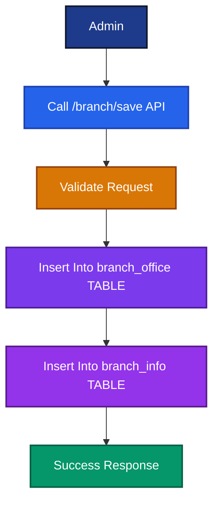
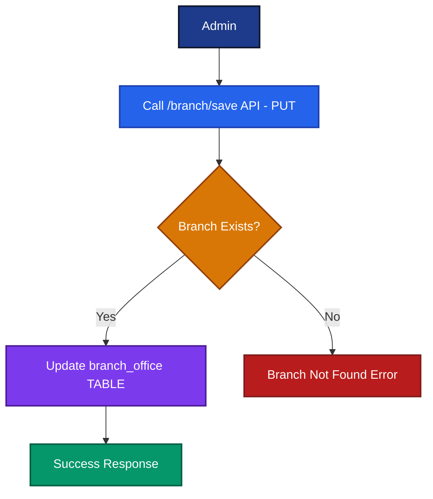
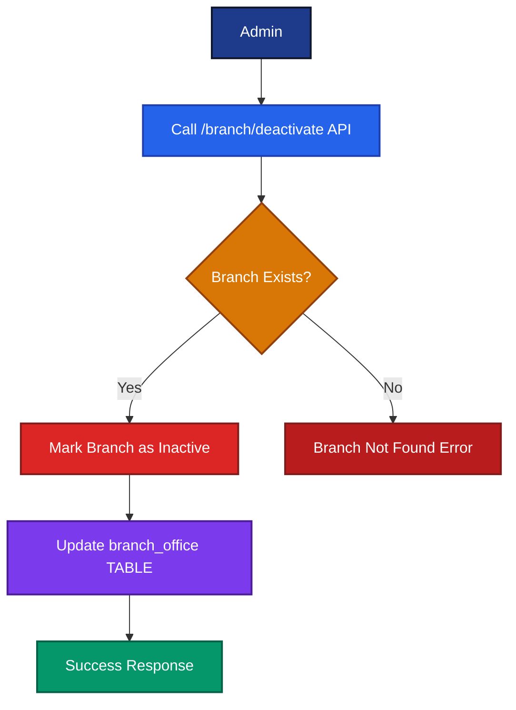
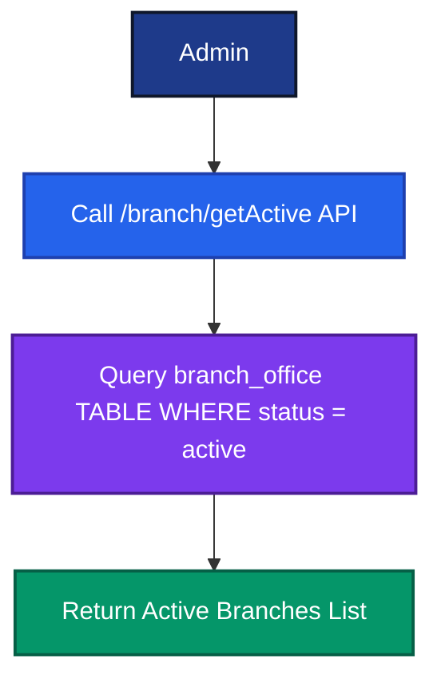
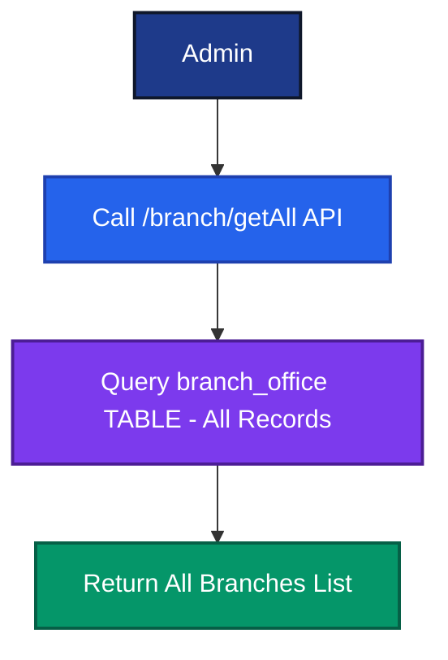
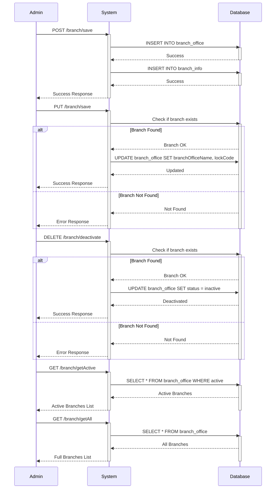

# Branch Control API Documentation
# ブランチ管理API ドキュメント

---

# 1. Save Branch
# ブランチ作成

## English

Admin creates a new branch by providing a branch office code, name, and lock code.

## Japanese

管理者はブランチコード、名前、ロックコードを指定して新しいブランチを作成します。

---

## Notes
## 注意事項

- Only Admin can create branches
  ブランチの作成は管理者のみが行えます

- `branchOfficeCode` must be unique
  `branchOfficeCode` は一意である必要があります

- Record is inserted into both `branch_office` and `branch_info` tables
  レコードは `branch_office` と `branch_info` の両テーブルに挿入されます

---

## Endpoint

```text
POST /branch/save
(ADMIN)
```

---

## Request

```json
{
  "branchOfficeCode": "HO123",
  "branchOfficeName": "Head Office",
  "lockCode": "12345"
}
```

## Response

```json
Success
```

---

## Flow Diagram



---

## Database Update

| Table         | Action        |
|---------------|---------------|
| branch_office | Insert Record |
| branch_info   | Insert Record |

---

# 2. Update Branch
# ブランチ更新

## English

Admin updates an existing branch's name and lock code using its branch office code.

## Japanese

管理者はブランチコードを使用して既存のブランチ名とロックコードを更新します。

---

## Notes
## 注意事項

- `branchOfficeCode` must already exist
  `branchOfficeCode` は既に存在している必要があります

- Only `branchOfficeName` and `lockCode` can be updated
  更新できるのはブランチ名とロックコードのみです

---

## Endpoint

```text
PUT /branch/save
(ADMIN)
```

---

## Request

```json
{
  "branchOfficeCode": "B3",
  "branchOfficeName": "Branch Three",
  "lockCode": "A527"
}
```

## Response

```json
Success
```

---

## Flow Diagram



---

## Database Update

| Table         | Action        |
|---------------|---------------|
| branch_office | Update Record |

---

# 3. Deactivate Branch
# ブランチ無効化

## English

Admin deactivates an existing branch. The branch is not permanently deleted but marked inactive.

## Japanese

管理者は既存のブランチを無効化します。ブランチは完全に削除されず、非アクティブとしてマークされます。

---

## Notes
## 注意事項

- Branch is deactivated, not deleted
  ブランチは削除ではなく非アクティブ化されます

- Only Admin can deactivate branches
  ブランチの無効化は管理者のみが行えます

---

## Endpoint

```text
DELETE /branch/deactivate
(ADMIN)
```

---

## Request

```json
{
  "branchCode": "B2"
}
```

---

## Flow Diagram



---

## Database Update

| Table         | Action                    |
|---------------|---------------------------|
| branch_office | Update Status to Inactive |

---

# 4. Get Active Branches
# アクティブブランチ取得

## English

Admin retrieves all currently active branches.

## Japanese

管理者は現在アクティブなすべてのブランチを取得します。

---

## Endpoint

```text
GET /branch/getActive
(ADMIN)
```

---

## Flow Diagram



---

# 5. Get All Branches
# 全ブランチ取得

## English

Admin retrieves all branches, including inactive ones.

## Japanese

管理者は非アクティブなブランチを含む、すべてのブランチを取得します。

---

## Endpoint

```text
GET /branch/getAll
(ADMIN)
```

---

## Flow Diagram



---

# API Summary
# API サマリー

| Endpoint             | Method | Description (EN)          | Description (JP)           |
|----------------------|--------|---------------------------|----------------------------|
| /branch/save         | POST   | Create new branch         | 新しいブランチを作成       |
| /branch/save         | PUT    | Update existing branch    | 既存ブランチを更新         |
| /branch/deactivate   | DELETE | Deactivate a branch       | ブランチを無効化           |
| /branch/getActive    | GET    | Fetch all active branches | アクティブブランチを取得   |
| /branch/getAll       | GET    | Fetch all branches        | 全ブランチを取得           |

---

# Complete Sequence Diagram
# 全体シーケンス図

