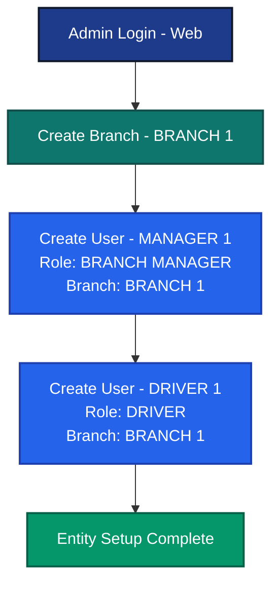
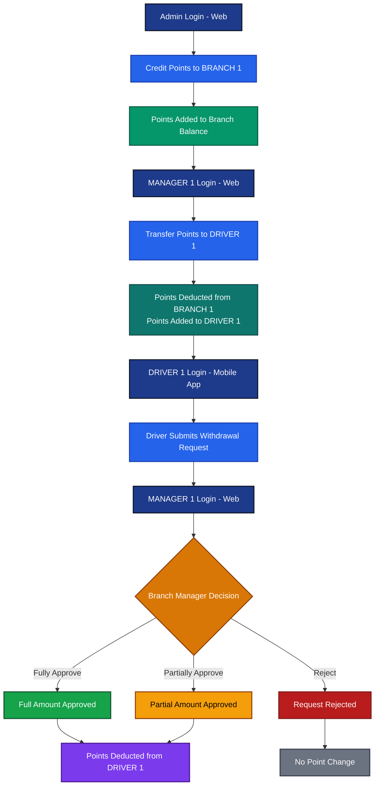
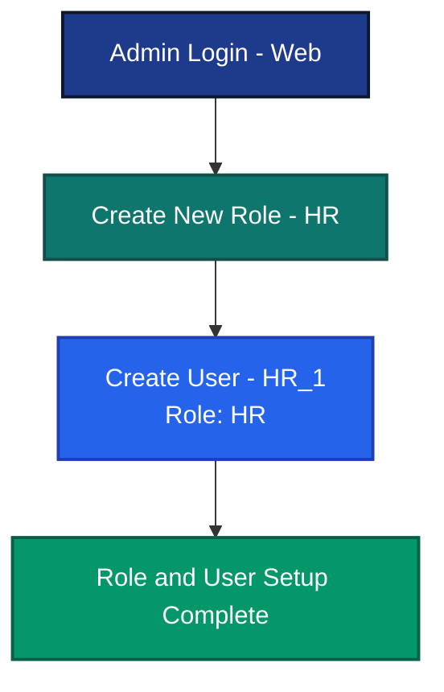
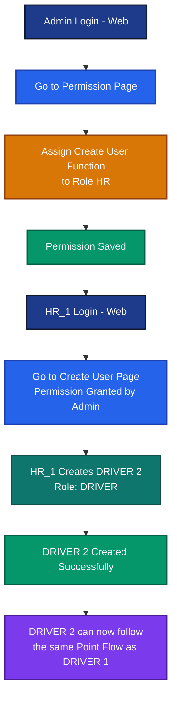
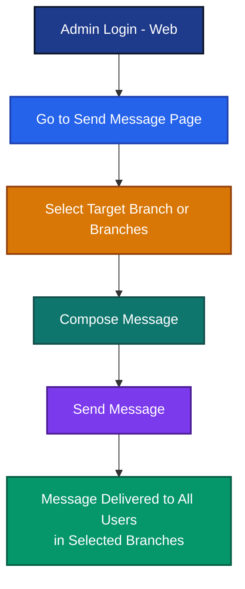
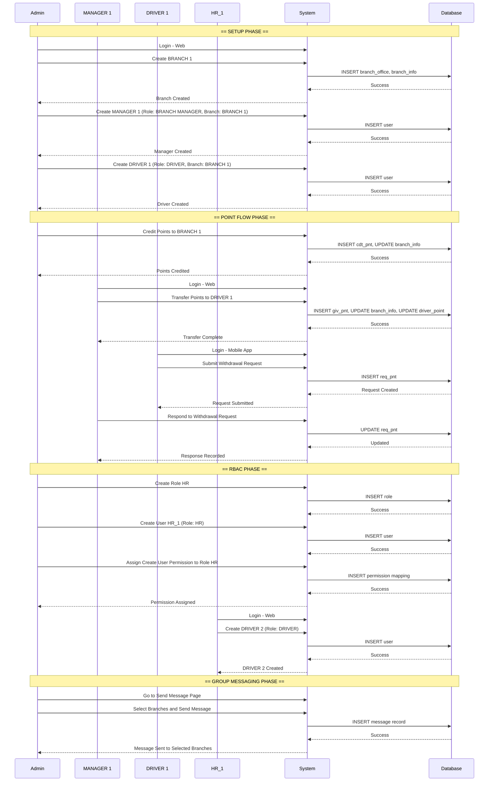

# DPS System Workflow Documentation
# DPS システム ワークフロー ドキュメント

---

# System Overview
# システム概要

## English

The DPS application is built around three core entities: **Role**, **Branch**, and **User**.
Access to all functions is governed by Role-Based Access Control (RBAC).

## Japanese

DPS アプリケーションは **ロール**、**ブランチ**、**ユーザー** の3つのコアエンティティで構成されています。
すべての機能へのアクセスはロールベースアクセス制御（RBAC）によって管理されます。

---

## Initial System State
## システム初期状態

| Entity  | Initial Value          | Notes                              |
|---------|------------------------|------------------------------------|
| Role    | ADMIN                  | System administrator role          |
| Role    | BRANCH MANAGER         | Branch-level management role       |
| Role    | DRIVER                 | Driver role — mobile login only    |
| User    | Super User / Admin     | Role: ADMIN — No branch assigned   |
| Branch  | None                   | No branches exist at startup       |

---

## Rules
## ルール

- Only Admin can assign permissions to a role
  権限の付与は管理者のみが行えます

- Drivers can only log in via the Mobile App
  ドライバーはモバイルアプリからのみログインできます

---

## Role Responsibilities
## ロールの責務

| Role           | Responsibilities (EN)                                         | Responsibilities (JP)                          |
|----------------|---------------------------------------------------------------|------------------------------------------------|
| ADMIN          | Manages Roles, Creates Branches, Assigns Permissions, Controls System | ロール管理、ブランチ作成、権限付与、システム制御 |
| BRANCH MANAGER | Manages Drivers, Transfers Points, Handles Withdrawals        | ドライバー管理、ポイント転送、出金対応          |
| DRIVER         | Receives Points, Requests Withdrawals                         | ポイント受取、出金申請                          |

---

## User Interface Access
## ユーザーインターフェースアクセス

| Interface  | Accessible By                              | Notes                                  |
|------------|--------------------------------------------|----------------------------------------|
| Web App    | Admin, Branch Manager, and other new roles | Drivers are NOT permitted on Web       |
| Mobile App | Driver only                                | Exclusively for Driver login and usage |

---

# Main Features
# メイン機能

---

# Feature 1 — User and Branch Entity Creation
# 機能1 — ユーザーおよびブランチエンティティ作成

## Step 1 — Login as Admin (Web)
## ステップ1 — 管理者としてログイン（Web）

```
Actor : Admin (Super User)
Interface : Web App
```

## Step 2 — Create a Branch
## ステップ2 — ブランチを作成する

```
Actor    : Admin
Action   : Create Branch
Example  : BRANCH 1
```

## Step 3 — Create a Branch Manager User
## ステップ3 — ブランチマネージャーユーザーを作成する

```
Actor    : Admin
Action   : Create User
Role     : BRANCH MANAGER
Branch   : BRANCH 1
Example  : MANAGER 1
```

## Step 4 — Create a Driver User
## ステップ4 — ドライバーユーザーを作成する

```
Actor    : Admin
Action   : Create User
Role     : DRIVER
Branch   : BRANCH 1
Example  : DRIVER 1
```

---

## Flow Diagram — User and Branch Creation
## フロー図 — ユーザーおよびブランチ作成



---

# Feature 2 — Point Flow
# 機能2 — ポイントフロー

## Step 1 — Admin Credits Points to Branch
## ステップ1 — 管理者がブランチにポイントを付与する

```
Actor    : Admin
Action   : Credit Points to BRANCH 1
Result   : Points credited to BRANCH 1 balance
```

## Step 2 — Branch Manager Transfers Points to Driver
## ステップ2 — ブランチマネージャーがドライバーにポイントを転送する

```
Actor    : MANAGER 1
Action   : Transfer Points to DRIVER 1
Result   : Points deducted from BRANCH 1 and added to DRIVER 1 account
```

## Step 3 — Driver Requests Withdrawal
## ステップ3 — ドライバーが出金申請を行う

```
Actor     : DRIVER 1
Interface : Mobile App
Action    : Submit Withdrawal Request for some points
Result    : Withdrawal request created — pending Branch Manager response
```

## Step 4 — Branch Manager Responds to Withdrawal Request
## ステップ4 — ブランチマネージャーが出金申請に回答する

```
Actor    : MANAGER 1
Action   : Review DRIVER 1 Withdrawal Request
Options  : Fully Approve / Partially Approve / Reject
Result   : Points deducted from DRIVER 1 account upon approval
```

---

## Flow Diagram — Point Flow
## フロー図 — ポイントフロー



---

# RBAC Feature
# RBACフィーチャー（ロールベースアクセス制御）

---

# RBAC 1 — Role Entity Creation
# RBAC1 — ロールエンティティ作成

## Step 1 — Login as Admin (Web)
## ステップ1 — 管理者としてログイン（Web）

```
Actor     : Admin
Interface : Web App
```

## Step 2 — Create a New Role
## ステップ2 — 新しいロールを作成する

```
Actor    : Admin
Action   : Create Role
Example  : HR
```

## Step 3 — Create a User with the New Role
## ステップ3 — 新しいロールでユーザーを作成する

```
Actor    : Admin
Action   : Create User
Role     : HR
Example  : HR_1
```

---

## Flow Diagram — Role Creation
## フロー図 — ロール作成



---

# RBAC 2 — Giving Permission to a Role
# RBAC2 — ロールへの権限付与

## Step 1 — Admin Assigns Permission
## ステップ1 — 管理者が権限を付与する

```
Actor    : Admin
Action   : Navigate to Permission Page
Action   : Assign "Create New User" function to Role HR
Example  : HR Role can now create users
```

## Step 2 — HR_1 Uses Granted Permission
## ステップ2 — HR_1 が付与された権限を使用する

```
Actor    : HR_1
Interface: Web App
Action   : Navigate to Create User Page
Action   : Create a new user with Role DRIVER
Example  : DRIVER 2 created
Note     : DRIVER 2 can now follow the same Point Flow as DRIVER 1
```

---

## Flow Diagram — Permission and Usage
## フロー図 — 権限付与と使用



---

# Other Features
# その他の機能

---

# Feature 3 — Group Messaging
# 機能3 — グループメッセージング

## English

Admin can send group messages to one or more branches at once via the Web App.

## Japanese

管理者はWebアプリから一度に1つまたは複数のブランチにグループメッセージを送信できます。

---

## Notes
## 注意事項

- Only Admin can send group messages
  グループメッセージの送信は管理者のみが行えます

- Admin selects one or more target branches before sending
  送信前に管理者は対象ブランチを1つ以上選択します

- All users within the selected branches receive the message
  選択されたブランチ内のすべてのユーザーがメッセージを受信します

---

## Step 1 — Login as Admin (Web)
## ステップ1 — 管理者としてログイン（Web）

```
Actor     : Admin
Interface : Web App
```

## Step 2 — Send Group Message
## ステップ2 — グループメッセージを送信する

```
Actor    : Admin
Action   : Navigate to Send Message Page
Action   : Select target Branch(es)
Action   : Compose and Send Message
Result   : Message delivered to all users in selected branches
```

---

## Flow Diagram — Group Messaging
## フロー図 — グループメッセージング



---

# Complete System Sequence Diagram
# システム全体シーケンス図

