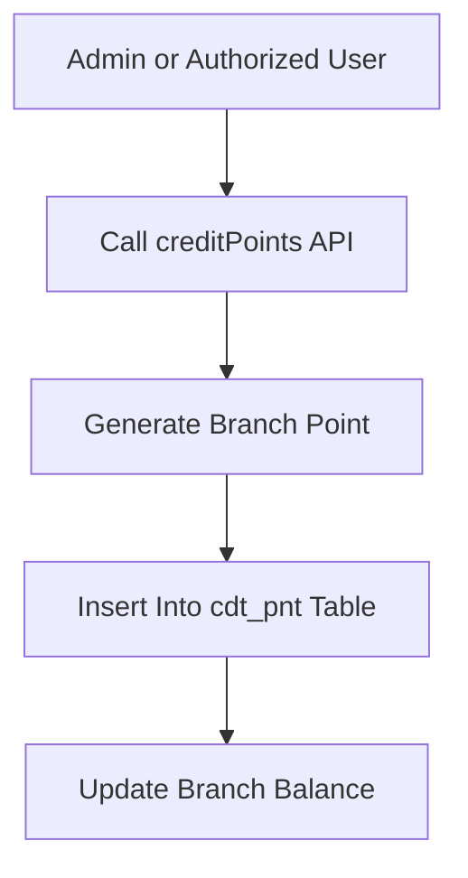
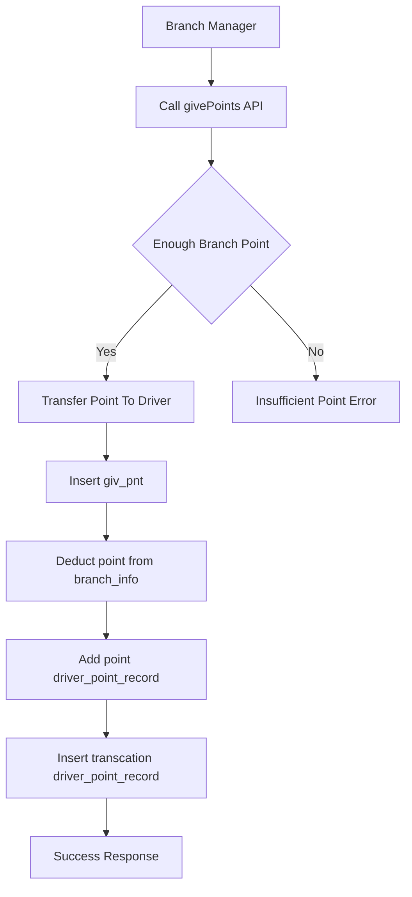
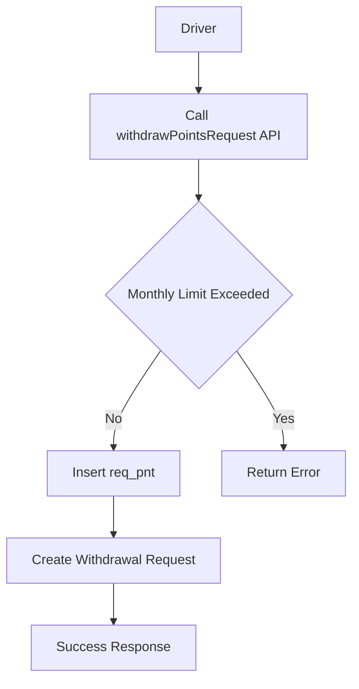
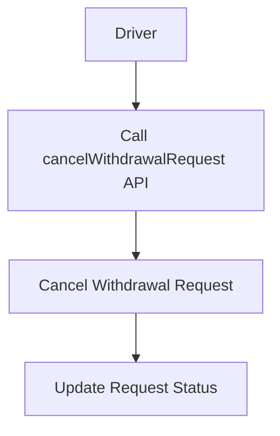
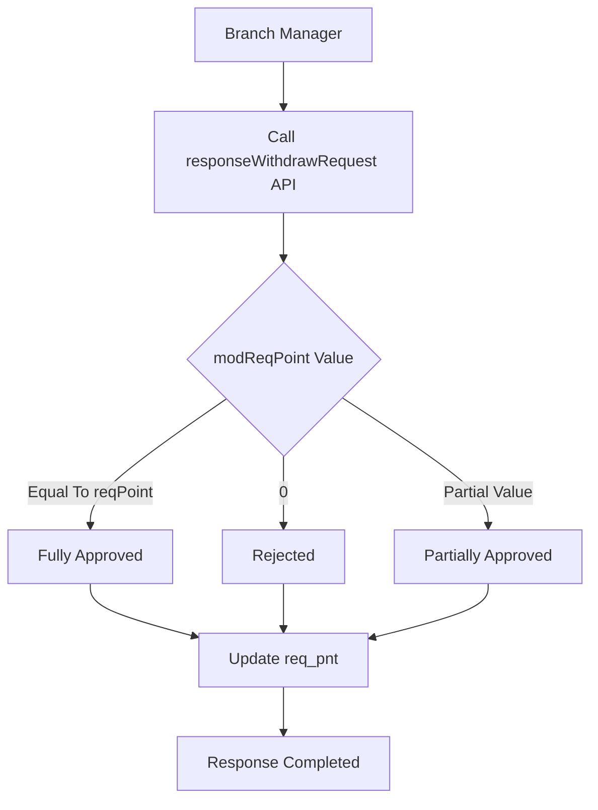
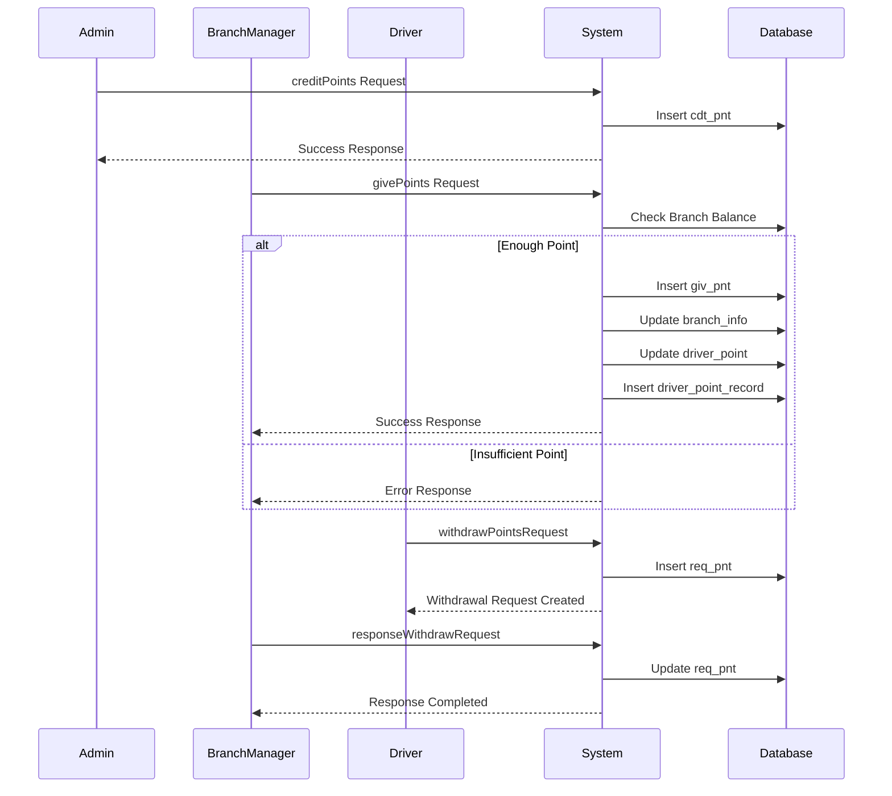

# Point Flow System Documentation
# ポイントフローシステム ドキュメント

---

# 1. Initial Point Generation
# 初期ポイント生成

## English

Points can be generated by Admin or any authorized role.

## Japanese

ポイントは管理者または権限を持つユーザーによって生成できます。

---

## Notes
## 注意事項

- Points are GENERATED, not transferred  
  ポイントは転送ではなく生成されます

- Giver does NOT need existing points  
  付与者は既存ポイントを持っている必要はありません

- Points belong to Branch, not Branch Manager  
  ポイントは支店に紐づき、支店長には紐づきません

---

## Endpoint

```text
POST /points/creditPoints
```

---

## Request

```json
{
  "divCode": "B1",
  "giverID": "admin",
  "point": 10000
}
```

---

## Flow Diagram



---

## Database Update

| Table | Action |
|---|---|
| cdt_pnt | Insert Record |

---

# 2. Branch To Driver Point Transfer
# 支店からドライバーへのポイント転送

## English

Branch Manager transfers points from Branch to Driver.

## Japanese

支店長は支店ポイントをドライバーへ転送します。

---

## Notes
## 注意事項

- Branch must have enough points  
  支店には十分なポイントが必要です

- Points are deducted from Branch balance  
  ポイントは支店残高から減算されます

---

## Endpoint

```text
POST /points/givePoints
```

---

## Request

```json
{
  "givePointUser": "BM1TT",
  "giveDivCode": "B1",
  "rcvUsrCode": "DR123",
  "rcvDivCode": "B1",
  "point": 1000
}
```

---

## Flow Diagram



---

## Database Update

| Table | Action |
|---|---|
| giv_pnt | Insert |
| branch_info | Deduct Point |
| driver_point | Add Point |
| driver_point_record | Insert |

---

# 3. Driver Withdrawal Request
# ドライバー出金申請

## English

Driver requests withdrawal of points.

## Japanese

ドライバーはポイント出金申請を行います。

---

## Endpoint

```text
POST /points/withdrawPointsRequest
```

---

## Request

```json
{
  "divCd": "B1",
  "reqPoints": "8000"
}
```

---

## Flow Diagram



---

## Database Update

| Table | Action |
|---|---|
| req_pnt | Insert Request |

---

# 4. Cancel Withdrawal Request
# 出金申請キャンセル

## Endpoint

```text
POST /points/cancelWithdrawalRequest
```

---

## Request

```json
{
  "reqPointsId": "RQ0000002"
}
```

---

## Flow Diagram



---

# 5. Branch Manager Response To Withdrawal
# 支店長による出金申請回答

## English

Branch Manager can fully approve, partially approve, or reject request.

## Japanese

支店長は全額承認、一部承認、または拒否できます。

---

## Endpoint

```text
POST /points/responseWithdrawRequest
```

---

## Request

```json
{
  "reqPointsId": "RQ0000041",
  "modReqPoint": "0"
}
```

---

## Conditions

| modReqPoint Value | Meaning |
|---|---|
| Equal To reqPoint | Fully Approved |
| 0 | Rejected |
| Less Than reqPoint But Greater Than 0 | Partially Approved |

---

## Flow Diagram



---

## Database Update

| Table | Action |
|---|---|
| req_pnt | Update Request |

---

# Complete Sequence Diagram
# 全体シーケンス図

