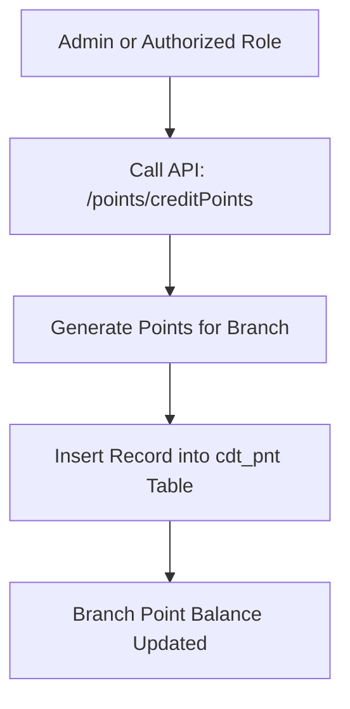
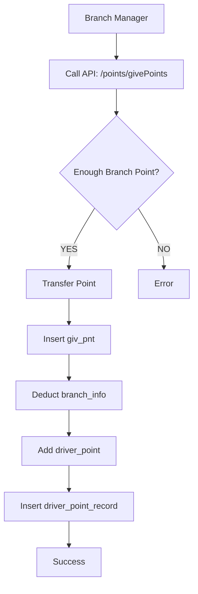
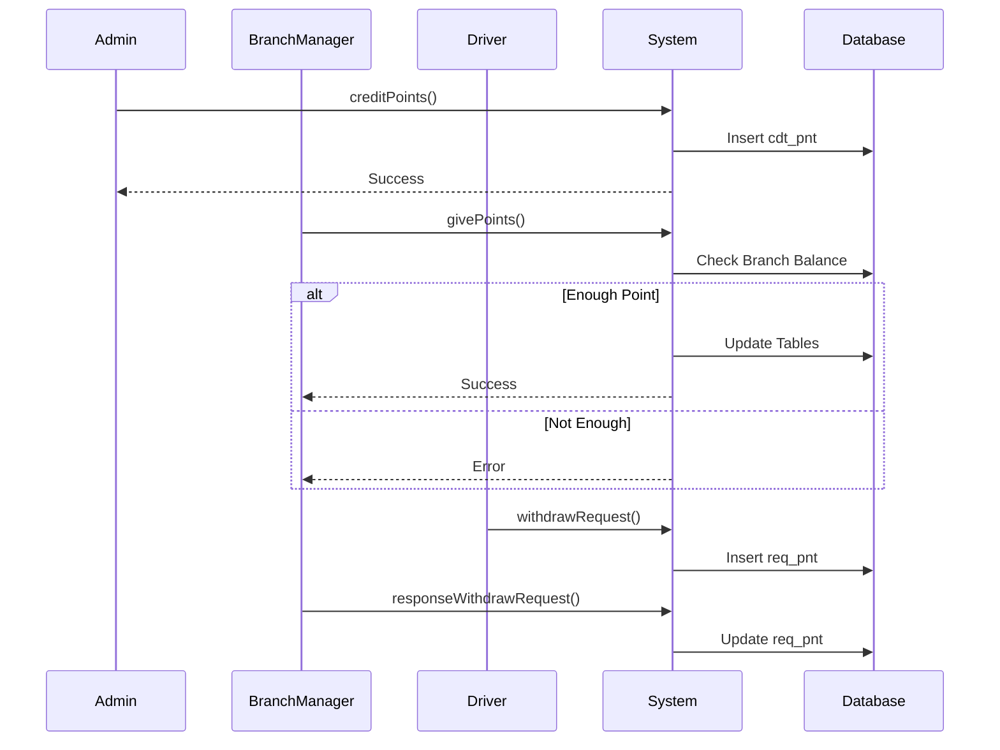

# 1. Initial Point Generation (Admin → Branch)
# 初期ポイント生成（管理者 → 支店）

English:
For Initial point creation, points can be generated by admin OR any other role if access is given.

Japanese:
初期ポイント作成では、管理者または権限を持つ他の役割がポイントを生成できます。



NOTE / 注意:
• Points are GENERATED, not transferred
  ポイントは転送ではなく生成されます

• Giver does NOT need existing points
  付与者はポイントを保有している必要はありません

• Points belong to Branch, not Branch Manager
  ポイントは支店に紐づき、支店長には紐づきません


API:
POST /points/creditPoints

Request:
{
  "divCode": "B1",
  "giverID": "admin",
  "point": 10000
}


# 2. Branch → Driver Point Transfer
# 支店 → ドライバー ポイント転送

English:
Points are transferred from Branch to Driver by Branch Manager.

Japanese:
ポイントは支店長によって支店からドライバーへ転送されます。


    
API:
POST /points/givePoints

Request:
{
  "givePointUser": "BM1TT",
  "giveDivCode": "B1",
  "rcvUsrCode": "DR123",
  "rcvDivCode": "B1",
  "point": 1000
}


# 3. Driver Withdrawal Request
# ドライバー出金申請

English:
Driver can request withdrawal of points.

Japanese:
ドライバーはポイント出金申請を行うことができます。

```mermaid
flowchart TD

    A[Driver]
    --> B[/points/withdrawPointsRequest]

    B --> C{Monthly Limit Exceeded?}

    C -->|NO| D[Insert req_pnt]

    D --> E[Success]

    C -->|YES| F[Error]
```

API:
POST /points/withdrawPointsRequest

Request:
{
  "divCd": "B1",
  "reqPoints": "8000"
}


# 4. Cancel Withdrawal Request
# 出金申請キャンセル

```mermaid
flowchart TD

    A[Driver]
    --> B[/points/cancelWithdrawalRequest]

    B --> C[Cancel Request]

    C --> D[Update Status]
```

API:
POST /points/cancelWithdrawalRequest

Request:
{
  "reqPointsId": "RQ0000002"
}


# 5. Branch Manager Response
# 支店長による出金申請回答

English:
Manager can fully approve, partially approve, or deny.

Japanese:
支店長は全額承認、一部承認、または拒否できます。

```mermaid
flowchart TD

    A[Branch Manager]
    --> B[/points/responseWithdrawRequest]

    B --> C{modReqPoint}

    C -->|= ReqPoint| D[Fully Approved]

    C -->|0| E[Denied]

    C -->|Partial| F[Partially Approved]

    D --> G[Update req_pnt]

    E --> G

    F --> G
```

API:
POST /points/responseWithdrawRequest

Request:
{
  "reqPointsId": "RQ0000041",
  "modReqPoint": "0"
}


# Complete Sequence Diagram
# 全体シーケンス図


