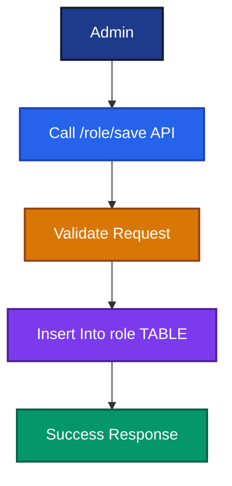
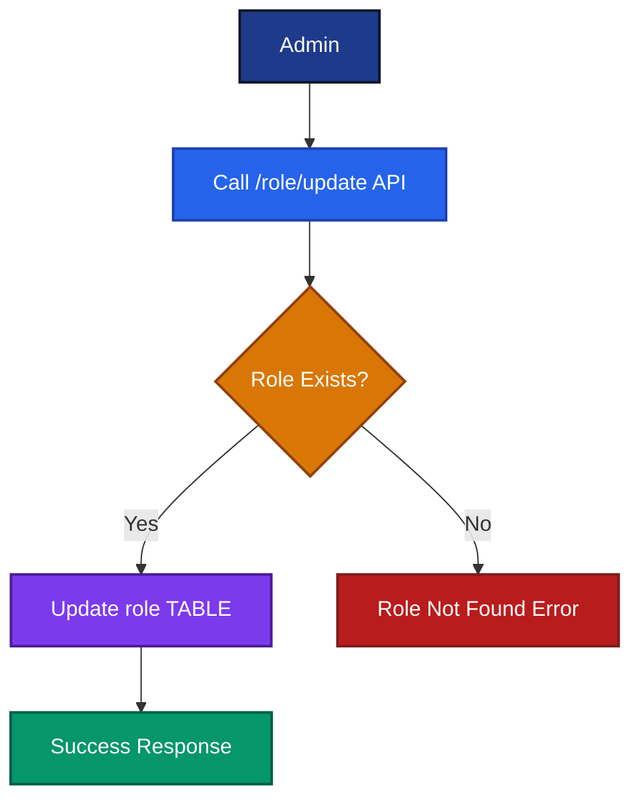
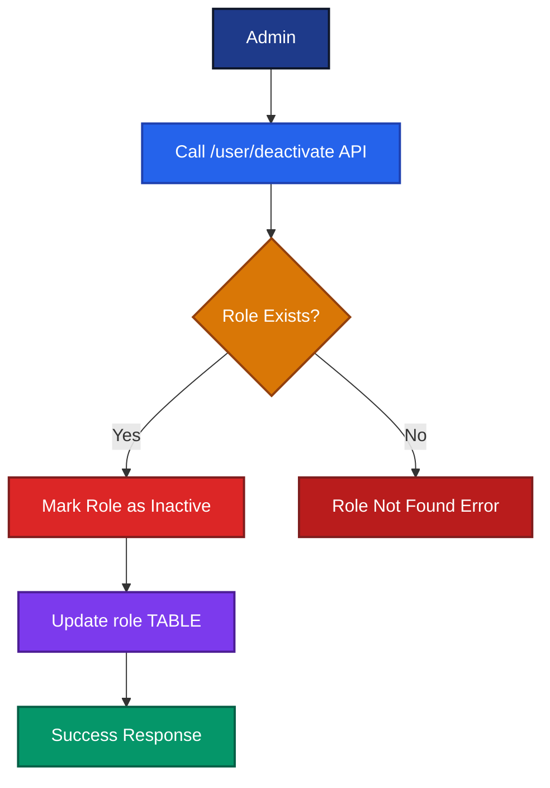
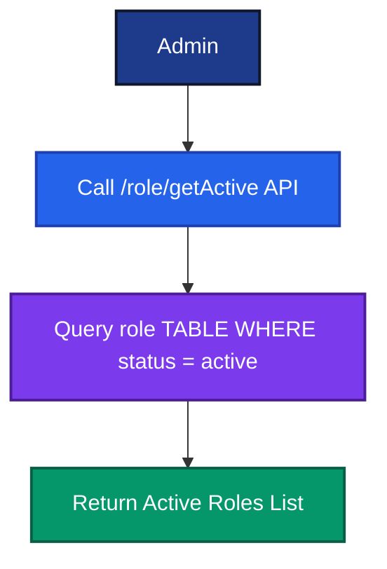
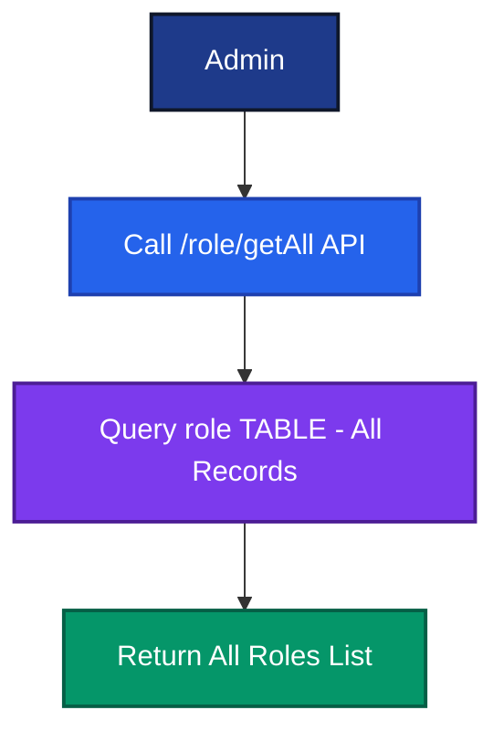
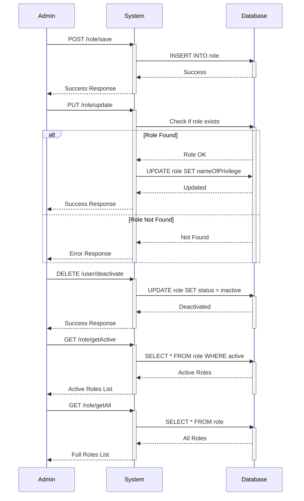

# Role Control API Documentation
# ロール管理API ドキュメント

---

# 1. Save Role
# ロール作成

## English

Admin creates a new role by providing a privilege code, name, and the user performing the action.

## Japanese

管理者は権限コード、名前、操作ユーザーを指定して新しいロールを作成します。

---

## Notes
## 注意事項

- Only Admin can create roles
  ロールの作成は管理者のみが行えます

- `privilegeCode` must be unique
  `privilegeCode` は一意である必要があります

---

## Endpoint

```text
POST /role/save
(ADMIN)
```

---

## Request

```json
{
  "privilegeCode": "AT",
  "nameOfPrivilege": "Accountent",
  "enteredByUser": "Admin"
}
```

## Response

```json
Success
```

---

## Flow Diagram



---

## Database Update

| Table  | Action        |
|--------|---------------|
| role   | Insert Record |

---

# 2. Update Role
# ロール更新

## English

Admin updates an existing role's name using its privilege code.

## Japanese

管理者は権限コードを使用して既存のロール名を更新します。

---

## Notes
## 注意事項

- `privilegeCode` must already exist
  `privilegeCode` は既に存在している必要があります

- Only the role name can be updated
  更新できるのはロール名のみです

---

## Endpoint

```text
PUT /role/update
(ADMIN)
```

---

## Request

```json
{
  "privilegeCode": "AC",
  "nameOfPrivilege": "Acct",
  "enteredByUser": "Admin"
}
```

## Response

```json
Success
```

---

## Flow Diagram



---

## Database Update

| Table  | Action        |
|--------|---------------|
| role   | Update Record |

---

# 3. Deactivate Role
# ロール無効化

## English

Admin deactivates an existing role. The role is not permanently deleted but marked inactive.

## Japanese

管理者は既存のロールを無効化します。ロールは完全に削除されず、非アクティブとしてマークされます。

---

## Notes
## 注意事項

- Role is deactivated, not deleted
  ロールは削除ではなく非アクティブ化されます

- Only Admin can deactivate roles
  ロールの無効化は管理者のみが行えます

---

## Endpoint

```text
DELETE /user/deactivate
(ADMIN)
```

---

## Request

```json
{
  "privilegeCode": "AC",
  "nameOfPrivilege": "Accountent",
  "enteredByUser": "Admin"
}
```

---

## Flow Diagram



---

## Database Update

| Table  | Action               |
|--------|----------------------|
| role   | Update Status to Inactive |

---

# 4. Get Active Roles
# アクティブロール取得

## English

Admin retrieves all currently active roles.

## Japanese

管理者は現在アクティブなすべてのロールを取得します。

---

## Endpoint

```text
GET /role/getActive
(ADMIN)
```

---

## Flow Diagram



---

# 5. Get All Roles
# 全ロール取得

## English

Admin retrieves all roles, including inactive ones.

## Japanese

管理者は非アクティブなロールを含む、すべてのロールを取得します。

---

## Endpoint

```text
GET /role/getAll
(ADMIN)
```

---

## Flow Diagram



---

# API Summary
# API サマリー

| Endpoint            | Method | Description (EN)        | Description (JP)       |
|---------------------|--------|-------------------------|------------------------|
| /role/save          | POST   | Create new role         | 新しいロールを作成     |
| /role/update        | PUT    | Update existing role    | 既存ロールを更新       |
| /user/deactivate    | DELETE | Deactivate a role       | ロールを無効化         |
| /role/getActive     | GET    | Fetch all active roles  | アクティブロールを取得 |
| /role/getAll        | GET    | Fetch all roles         | 全ロールを取得         |

---

# Complete Sequence Diagram
# 全体シーケンス図

